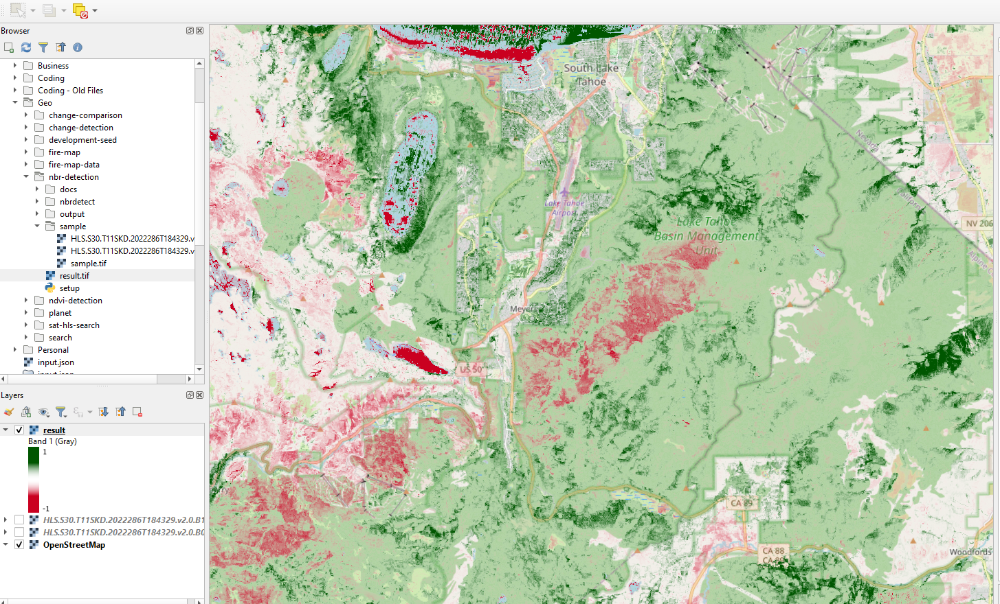

# NBR Detection

The task is to determine **Normalized Burn Ratio** values and output a geotiff based on given COG bands.

For more information, please refer to this [explanation](https://un-spider.org/advisory-support/recommended-practices/recommended-practice-burn-severity/in-detail/normalized-burn-ratio) on un-spider.

## Prerequisite

To run the script, libraries are required.

- GDAL
- rasterio
- numpy

These can be installed in a new virtual env or found in a pre-existing docker image [Development Seed](https://developmentseed.org/blog/2017-08-17-introducing-geolambda) offers.

## How to

The script can be ran from the command line or included in a project as an import.

### Command line

The python script can be ran from the command line. Two arguments are required, an input and output file path, name.

`python detect.py sample/cog output/output.tif`

#### Example

*From README directory*

`python nbrdetect/detect.py sample/HLS.S30.T11SKD.2022286T184329.v2.0 output/output.tif`

The GeoTiff(`output/output.tif`) was generated by the above command.



### Importing

Once the repo is built/installed with python's setup tools (`python install .`), you can access key functions to calculate NBR values of a geotiff.

`from nbrdetect import evaluate_band_burn_ratio, evaluate_cog_burn_ratio`

Once imported, these functions can be used to determine NBR values.

#### Example Usage

```
from ndvidetect import evaluate_cog_burn_ratio
    
if __name__ == "__main__":
    fn_cog = 'sample/HLS.S30.T11SKD.2022286T184329.v2.0'
    fn_out = 'output/output.tif'
    evaluate_cog_burn_ratio(fn_cog, fn_out)
```

Further documentation is included on the functions.